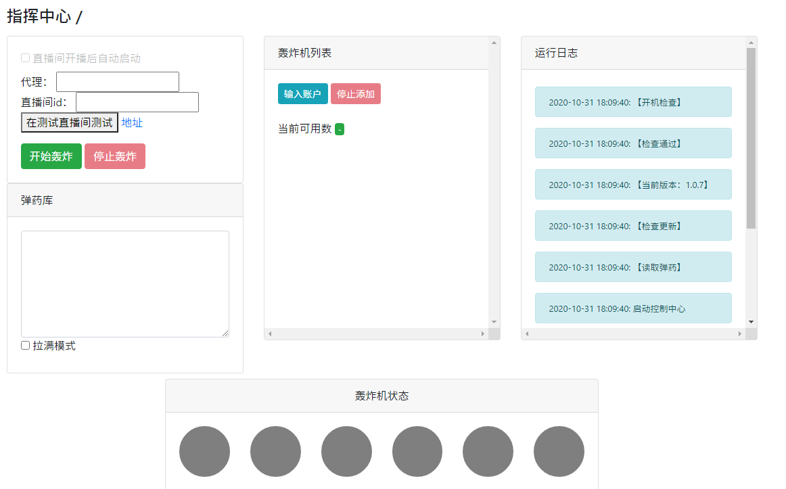
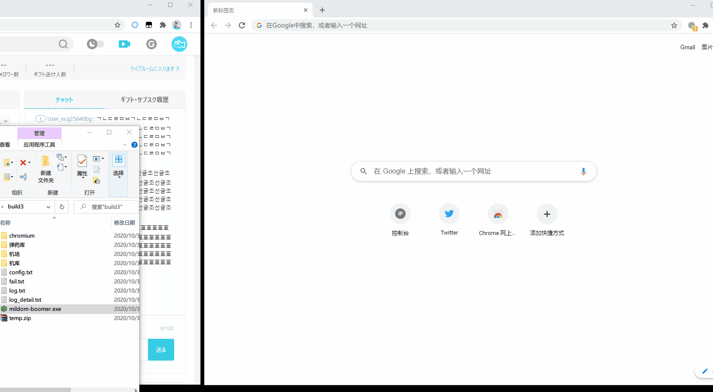

## 全自动冲蝗工具

# 下载地址:
1.0.7完整包（第一次下载需要下载完整包，之后只要下载更新包替换主程序就可以了）

https://github.com/AnalystForCOCO/share/releases/download/1.0.7/mildom-boomer-v1.0.7.7z

更新包地址：下文件名带update的那个：

https://github.com/AnalystForCOCO/share/releases/latest

备用下载地址

https://www.kzwr.com/sx 手信码：5050e890e759

---
---
先放效果图（大图警告）：

## 启动轰炸

## 转换账号

### 如果你觉得这工具好使，欢迎私信捐助404小号给我

### 我知道还有另一批人在主攻404，也算给他们提前准备弹药

---
前置说明：

0、推特批量登录账号非常耗IP，请准备好有多个节点的梯子

1、为了不被滥用，本程序不会在4vIP下运行，且每个版本都会设定一个月后失效，请及时更新噢~

2、本程序不需要管理员权限

3、本程序不开放源代码给普通人，爽哥可以（如果需要请私信我）

4、自动监控直播间开播自动轰炸功能还在做

5、为了加快轰炸机速度所有图片都是不加载的，所以在程序打开的浏览器里看不见图片是正常现象

6、程序虽然有自动更新功能，但是没怎么测过，如果发生问题了请主动下载更新包

7、程序自动更新后不会自动重启，需要手动再打开一次主程序

---
使用流程：

打开mildom-boomer.exe主程序，就会自动弹出管理界面

0.1、准备推特账号列表（比如从https://accsmarket.com/ 购买，0.05不带 (may require confirmation by SMS)这句话的那档就可以）

0.2、如果是ss一类需要手动设置的请在左侧代理输入框输入代理的地址（如socks5://127.0.0.1:1080）

如果使用的vpn/全局代理的梯子就不需要设置

### 1、点击输入账号以后把买到的推特号贴进去，接着点【开始生成舰队】

### 2、这个时候程序会打开一个浏览器窗口自动用推特号登录mildom，然后存入机库
可能遇到的问题：

这个过程可能会遇到IP受限/需要验证码的问题

IP受限时请更换代理节点，然后再次点击生成舰队（目前测试基本同一个ip登录十个号就会被限制）

如果是谷歌验证码可以尝试验证过去，如果遇到过不去或者懒得验证的直接把程序打开的浏览器关了就会忽略这个账号

### 3、准备就绪，接下来可以到测试场先测试（参照上面的效果图）
可以到自己的直播间测试（填写到直播间ID框里，再点开始轰炸）

但需要把自己直播间的标题改成这串英文（SFIAJSOIDAOSICNISHDFOWQAGFJIOSAJD），否则将视为滥用工具不予轰炸

轰炸机的调整参考下面的文件说明

### 4、测试完成后，就静待kson开播以后开冲啦

---
文件说明：

关于配置文件（config.txt）：

请参照下面这个示例

{
  attack_number: 6,
  
  // 同时开启6台轰炸机进行轰炸，电脑不好的可以减少，想增加的请看好自己电脑的内存和cpu量力而行（多开请记得账号也要够多，不然很容易就打完了）

  proxy: 'socks5://127.0.0.1:1080',
  
  // 经常用ss的人应该很了解怎么填了，不过这里仅设置程序开启时的默认值，可以直接在实时管理界面修改（如果是全局/vpn式的代理这里不填）

  updateUrl: 'https://github.com/AnalystForCOCO/share/releases',
  
  // 更新地址，如果没有发生什么意外不用管

  coldTime: 30000,
  
  // 房间限制的发言时间，这里表示轰炸机轰炸后会冷却30秒才会再次轰炸
}

机库文件夹

存放账号用的

机场文件夹

用来启动轰炸机的临时文件夹，请无视

弹药库

存放弹药的

fail.txt

登录失败的账号会写进这个文件里，建议别想着捞回来了直接扔掉吧

log.txt

在网页上显示的日志

log_detail.txt

还有一些更详细的日志信息会写在这里，程序出问题的时候来找我的时候请附上这个文件

---
# 最后再提一次

### 如果你觉得这工具好使，欢迎私信捐助404小号给我

### 我知道还有另一批人在主攻404，也算给他们提前准备弹药
